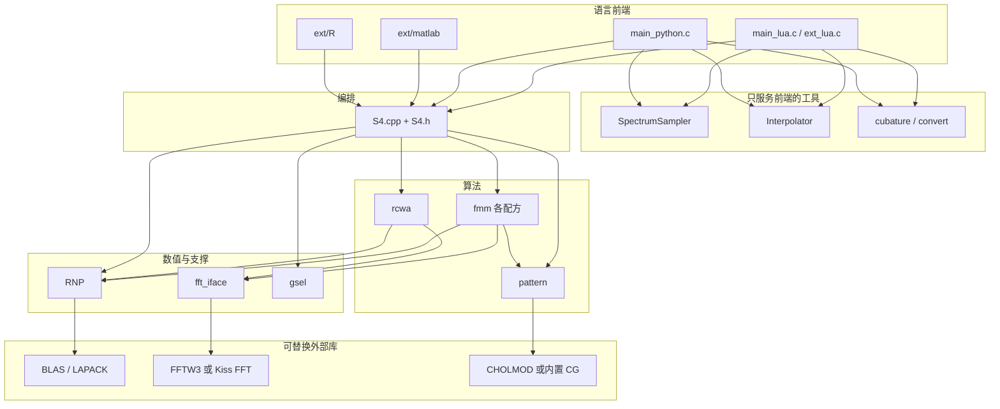

# S4 顶层结构：模块、依赖、内聚与解耦

S4（Stanford Stratified Structure Solver，版本见 `S4/config.h` 的 1.1.1）用严格耦合波分析（RCWA）计算周期分层结构中的电磁场。生产代码集中在 `S4/`，由 `Makefile.common` 编成静态库 `libS4.a`，再挂上 Lua / Python 等前端。`S4r/` 是同一问题的另一套 C++ 重写，不进入这条主构建。

仓库顶层可以分成四块：

| 目录 | 角色 | 是否进入主构建 |
| --- | --- | --- |
| `S4/` | 生产求解器：编排、RCWA、傅里叶配方、几何、数值库、脚本入口 | 是，产物为 `libS4.a` 与可执行文件 `S4` |
| `modules/` | 一维/二维自适应采样，独立动态库 | 随 `make` 编出，但不链接求解器 |
| `ext/` | MATLAB mex 与 R 包，只调用 `S4.h` | 各自单独构建 |
| `S4r/` | 基于 Eigen 的重写（材料、层、网格、星积） | 否 |

`examples/`、`testing/`、`doc/`、`docold/` 是示例、回归和文档，不参与库的模块边界。`Eigen/` 只给 `S4r` 用。`Cgeom/` 目前是空目录，`S4r/periodic_off2.c` 期望的计算几何头文件并不在树里。`S4/Patterning.cpp` 与 `S4/SpecialFunction.hpp` 不在 `Makefile.common` 的目标列表中，不属于已构建产品。

## 生产内核的模块

官方开发说明（`docold/dev_info.md`）把运行时分成三层：脚本入口、`S4.cpp` 编排、`rcwa.cpp` 算法。按源码和链接关系，实际可以再拆成下面这些职责单一的模块。

### 1. 语言前端

只做参数编解码、对象生命周期和脚本 API，不实现 RCWA。

- `S4/main_lua.c`：Lua 可执行文件，以及 `RCWA.so`。可选 `HAVE_MPI`。
- `S4/main_python.c`：Python 扩展。
- `S4/ext_lua.c`：较新的 S4v2 Lua 绑定，配合 `ext_lua.h`。
- `ext/matlab/S4mex.c` 加 `S4Simulation.m` / `S4Layer.m` / `S4Material.m`。
- `ext/R/S4v2/`：R 的外部指针包装。

这些文件包含的求解器头文件是 `S4.h`，再加上单位换算和采样工具，不包含 `rcwa.h` 或 `fmm/fmm.h`。

### 2. 编排层 `S4.cpp` / `S4.h` / `S4_internal.h`

`S4.h` 用 `extern "C"` 暴露 C 接口：创建/销毁 `S4_Simulation`，登记材料、层、区域和激励，查询功率流、场、应力等。`S4_Simulation` 在公开段先声明为不完整类型。

`S4_internal.h` 把仿真收成一块 POD：实空间/倒格矢基矢、G 列表、材料数组、层数组（层内嵌 `Pattern`）、频率与激励、解缓存、`S4_Options`。`S4.cpp` 负责：

- 把用户几何写成 `pattern` 的 `shape`；
- 用 `G_select` 决定傅里叶阶；
- 按选项选择一种 FMM，得到 `Epsilon2` 与 `Epsilon_inv`；
- 调用 `SolveLayerEigensystem*` 与 S 矩阵例程；
- 缓存层模式和全堆叠解，几何或频率变化时作废缓存。

层的 `copy` 字段让复制层复用已有模式，避免重复做同一套傅里叶展开。

### 3. RCWA 核心 `rcwa.cpp` / `rcwa.h`

注释写明：这里只处理已经变成傅里叶系数的层，介电函数怎么展开在别处完成。公开例程都是裸数组和标量，签名不出现 `S4_Simulation`：

- `SolveLayerEigensystem` / `SolveLayerEigensystem_uniform`：层波导模式；
- `InitSMatrix` / `GetSMatrix` / `SolveAll` / `SolveInterior`：层叠 S 矩阵与给定入射下的振幅；
- `GetFieldAtPoint`、`GetFieldOnGrid`、`GetZPoyntingFlux*`、应力与体积分：由模式振幅还原可观测量。

工作区参数沿用 LAPACK 风格：可查询 `lwork`，也可由调用方传入缓冲。

### 4. 傅里叶模态法 `S4/fmm/`

多种介电傅里叶配方，输入输出相同：给定仿真与层，写出 `Epsilon2`（面内耦合）和 `Epsilon_inv`。`fmm.h` 用函数指针类型 `FMMGetEpsilon` 把这个契约写出来。实现文件各自一份：

| 实现 | 何时被 `S4.cpp` 选中 |
| --- | --- |
| `fmm_closed.cpp` | 默认解析傅里叶（形状的封闭形式变换） |
| `fmm_FFT.cpp` | `use_discretized_epsilon` |
| `fmm_kottke.cpp` | 离散化并且 `use_subpixel_smoothing` |
| `fmm_PolBasisVL.cpp` / `NV` / `Jones` | 在 FFT 或封闭形式之后再做偏振基分解 |
| `fmm_experimental.cpp` | `use_experimental_fmm` |
| `fmm_common.cpp` | Lanczos 平滑阶数等共用标量 |
| `fft_iface.cpp` | 二维复 FFT 的唯一入口 |

选择发生在 `S4.cpp` 里生成介电矩阵的那一段分支，依据 `S4_Options` 的布尔开关，而不是运行时插件表。`FMMGetEpsilon` 这个 typedef 目前没有被赋给变量。

### 5. 图案几何 `S4/pattern/`

自包含的二维图案库，不包含麦克斯韦方程。`pattern.h` 定义 `shape`（圆、椭圆、矩形、多边形）和 `Pattern`（形状数组加包含树 `parent`）。对外能力：

- `Pattern_GetContainmentTree`：不交形状的包含森林；
- `Pattern_GetFourierTransform`：给定各形状内外标量值，求倒格点上的解析变换；
- `Pattern_DiscretizeCell`：网格单元内的面积分数；
- `Pattern_GenerateFlowField`：贴合界面的法向/切向矢量场，供偏振基使用。

`intersection.c` 提供多边形面积、凸多边形求交、三角剖分。`predicates.c` 是 Shewchuk 风格的定向谓词。矢量场的稀疏求解在 `HAVE_LIBCHOLMOD` 时走 CHOLMOD，否则走文件内的共轭梯度。

编排层和 FMM 都通过 `Pattern_*` 调用它；几何模块反过来不包含 `S4.h`。

### 6. 数值线代 `S4/RNP/`

头文件模板库，命名空间 `RNP`。`TBLAS.h` 是 BLAS 子集，`TLASupport.h` 是辅助（LU、行列式、置换），`LinearSolve.h` 是参考实现的线性求解，`Eigensystems.cpp` 是不依赖 LAPACK 时的特征求解。定义 `RNP_HAVE_BLAS` / `RNP_HAVE_LAPACK` 后，对应头文件在参考实现之后再包含 `TBLAS_ext.h`、`LinearSolve_lapack.h`，用外部库覆盖同名接口。调用方只写 `RNP::TBLAS::` 和 `RNP::LinearSolve`。

`rcwa.cpp`、`S4.cpp` 和各个 `fmm_*.cpp` 都依赖它。RNP 不包含任何 S4 类型。

### 7. 小型支撑

- `gsel.c` / `sort.c`：按圆形或平行四边形截断挑选 G 矢量。只依赖倒格矢基矢和整数容量，供 `S4.cpp` 使用。
- `kiss_fft/`：无 FFTW 时的 FFT。业务代码不直接分叉到 Kiss 与 FFTW，只走 `fft_iface.h` 的 `fft_plan_dft_2d`。
- `numalloc.c`：对齐分配。`rcwa.cpp` 用自己的 `rcwa_malloc`，与仿真对象的分配器分开。
- `SpectrumSampler.c`、`Interpolator.c`、`cubature.c`、`convert.c`：光谱自适应采样、插值、数值积分、单位换算。链进 `libS4.a`，但只被 Lua/Python 入口调用，求解路径不依赖它们。

`modules/function_sampler_1d.c` 与 `function_sampler_2d.c` 是同一类采样思想的后继，编成 `FunctionSampler1D.so` / `FunctionSampler2D.so`，带 Lua 与 Python 包装。它们不包含 `S4.h`，可以单独使用。

## 依赖关系

依赖是单向的：上面的层知道下面的契约，下面的层不知道脚本语言，也不知道“这是一次光子晶体仿真”。

一次求解的数据也按这个方向流：

1. 前端把晶格、材料、形状、频率、入射写成 `S4_Simulation_*` 调用。
2. 编排层用 `G_select` 得到平面波阶，把形状放进 `Pattern`。
3. 某一种 `FMMGetEpsilon_*` 通过 `Pattern_GetFourierTransform`、`Pattern_DiscretizeCell` 或 `Pattern_GenerateFlowField`，加上 `fft_iface`，产出两块复数矩阵。
4. `SolveLayerEigensystem` 只看见 `omega`、`kx`/`ky` 和这两块矩阵，返回传播常数 `q` 与特征矩阵。
5. S 矩阵组装和场/功率查询仍留在 `rcwa`，结果经 `S4.h` 回到脚本。

`S4r` 内部是另一张图，与上图没有链接关系：`Types.hpp`（Eigen 矩阵别名）被所有类使用；`Shape` 依赖 `intersection`；`PeriodicMesh` 依赖 `Shape` 与 `periodic_off2`；`Layer` 聚合形状并调用 `Eigensystems`；`Simulation` 聚合 `Material`、`Layer`、`PeriodicMesh`，并用 `StarProduct`（S/T 矩阵星积）和 `Pseudoinverse` 组堆叠。`S4r.cpp` 与 `lua_named_arg` 是它自己的 Lua 前端。`IRA` 是内部特征值迭代，供 `Eigensystems` 与 `Pseudoinverse` 使用。

## 内聚是怎么做到的

每个模块的头文件就是它的职责边界，实现细节留在 `.c` / `.cpp` 里。

**按物理步骤切分，而不是按文件大小切分。** 几何（图案是否包含、傅里叶系数是多少）、配方（如何把不连续介电函数收成矩阵）、模式与 S 矩阵（给定矩阵后的本征问题和散射）、脚本（如何把 table 变成 C 调用）分属不同目录。改一种 Li 因子或偏振基，只增加或替换 `fmm/` 下的一个翻译单元，RCWA 循环不用改。改 S 矩阵数值稳定性，不应碰到圆和多边形。

**同一模块内共享一种数据形状。** FMM 各文件都写出 `Epsilon2` 与 `Epsilon_inv`，并约定 `epstype`（满矩阵或块对角标量，见 `rcwa.h` 的 `EPSILON2_TYPE_*`）。`pattern` 的全部查询都建立在“已按面积排序的形状 + `parent` 包含树”上，解析变换、栅格化和流场是同一结构的三种读法。`S4_Layer` 把厚度、背景材料、`Pattern` 和模式缓存放在一起，因为它们的失效条件相同：改区域就要 `Simulation_DestroyLayerModes`。

**数值代码保持领域无关。** RNP、Kiss FFT、`gsel`、`sort`、`SpectrumSampler`、`Interpolator`、`modules/` 的采样器都不出现层、材料或晶格对象。`rcwa` 同样只谈 `n`、`kx`、`ky` 和矩阵指针，文件头明确把“介电函数的傅里叶展开”排除在外。这样 RCWA 的内聚是“分层介质的模式与散射”，不是“S4 这个程序的全部”。

**编码约定强化了这种切分。** 开发说明要求主体是带 POD 的 C 风格 C++，除 RNP 外不用继承、多态和模板；函数用整数错误码（负值表示第几个参数非法）和可选工作区。模块之间传递的是数组和结构体，不是对象图，调用关系可以从签名读出来。

## 解耦是怎么做的

**稳定的 C ABI 挡住语言差异。** `S4.h` 把构造、材料、层、区域、激励和输出都放在 `extern "C"` 里。Lua、Python、MATLAB、R 四个前端彼此不引用，替换或新增一种语言只需再写一个绑定。核心以 `libS4.a` 交付，前端链接它。`modules/` 的采样器甚至不进这个库，单独成为 `.so`，避免把自适应采样和电磁求解绑成一个二进制。

**算法层用数组契约，不用仿真对象。** `rcwa.h` 不包含 `S4.h`。编排层负责从 `S4_Simulation` 里取出 `omega`、`kx`、`ky` 和介电矩阵，再调用 RCWA。因此 RCWA 可以在不知道材料名、形状标签和 Lua 状态的情况下测试和替换。FFT 同样被 `fft_iface.h` 收成 `fft_plan` 不透明指针：`HAVE_LIBFFTW3` 时走 FFTW，否则走 Kiss FFT，FMM 调用点不变。

**可替换后端放在编译开关后面。** RNP 先给出可移植实现，再在 `RNP_HAVE_BLAS` / `RNP_HAVE_LAPACK` 下包含覆盖头。没有 LAPACK 时 `Makefile.common` 才把 `Eigensystems.cpp` 编进库。CHOLMOD、pthread（FFT 计划的互斥）、MPI（`main_lua.c` 的并行频率扫描）都是同一种模式：缺省路径完整，外部库只替换热点。业务模块不出现 `zgeev_` 或 `fftw_plan` 这类符号。

**配方用统一签名并列，由选项开关选择。** 新增一种傅里叶因子分解，就是再实现一个 `FMMGetEpsilon_*`，并在编排层的分支里挂上。RCWA 与几何库都不用知道 Kottke、Jones 或法向基的差别。开关本身是 `S4_Options` 里的整数标志，属于仿真对象的数据，不是散落的全局变量。

**依赖注入的范围控制在必要处。** 日志通过 `S4_message_handler` 函数指针注入，核心用 `S->msg` 报告错误和进度，不绑定 `stdout` 或某种脚本运行时。内存上，RCWA 允许调用方传入 `work`，减少重复求解时的分配；`numalloc` 则把对齐策略收口，便于换平台分配器。

**复制层把“结构相同”从“计算过程”里拆开。** `S4_Layer.copy` 指向另一层后，材料与图案继承对方，模式不必重算。几何数据与数值结果因此可以共享，而不把层对象做成继承层次。

## 仍然耦合的地方

这些边界并没有全部封死，读代码时需要单独看待。

`S4.h` 在公开声明之后 `#include "S4_internal.h"`，`S4_Simulation` 的字段对所有包含该头文件的翻译单元可见。`main_lua.c` 直接写 `S->options` 和 `S->layer[]`。`doc/Capi.md` 把这称为从旧接口过渡到不透明对象的中间状态，目标是只留 `S4.h`、逐步去掉 `S4_internal.h`。在此之前，前端与内存布局是编译期耦合的。

FMM 实现包含 `S4.h`，直接读取 `S->G`、`S->Lk`、`S->options` 和 `L->pattern`。它们与编排层共享了仿真对象的布局，只在“写出的矩阵格式”上与 RCWA 解耦。`FMMGetEpsilon` 已经描述了可替换的函数类型，但调度仍是 `S4.cpp` 中的 `if/else`，不能在不改编排层的情况下从外部注册配方。

全部核心翻译单元打进同一个 `libS4.a`。逻辑模块是分开的，发布单元不是：不能单独替换 RCWA 共享库而不重链前端。`SpectrumSampler` 等工具虽不被求解器调用，却仍然进这个静态库。

`S4r` 与 `S4` 并行存在，几何谓词、求交和特征求解各有一份。它用 Eigen 类型和 C++ 值对象替代 RNP 与 POD，模块划分更接近“材料 / 层 / 网格 / 仿真”，但没有接到 `Makefile.common`，也没有成为生产前端背后的实现。

## 对照

| 问题 | 结论 |
| --- | --- |
| 有哪些模块 | 前端、编排（`S4.cpp`）、RCWA、FMM、pattern、RNP、FFT 抽象、G 矢量选择，以及独立的采样器；另有未接入主构建的 `S4r` |
| 谁依赖谁 | 前端 → 编排 →（FMM 与 RCWA）；FMM → pattern 与 FFT；FMM 与 RCWA → RNP；RNP / FFT / pattern 再落到可选的 BLAS、LAPACK、FFTW、CHOLMOD |
| 内聚 | 按“几何、傅里叶配方、模式与散射、数值、脚本”切开；同一步骤的多种算法共享输入输出 |
| 解耦 | C ABI、RCWA 的数组接口、FFT 与 BLAS 的编译期替换、FMM 的并列签名、消息回调、采样器独立成库 |
